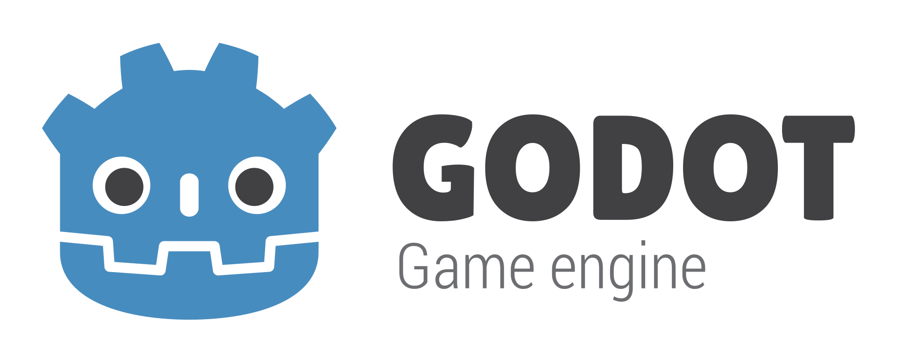

# sen_godot
Open source Image Generator based on Godot 4.4.1 and sen 5.2.0

#### Open tasks:
- Consume 3d tiles from local / self-hosted server
- Have predefined viewports for the 3d models
- Make the attached view be able to move with mouse and keyboard input as in free view
- Multiple cameras at the same time with viewports
- When attached to an entity, update the georeference node